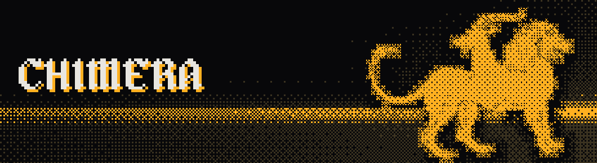

# Chimera

CV-addressable breakbeat slicer for the Expert Sleepers **Disting NT** — one beast stitched from two breaks. Inspired by [amen](https://norns.community/amen/) (norns) and zeptocore/[ectocore](https://getectocore.com/).

**[Read the manual](https://visti.github.io/disting-chimera/)**

## What it does

- Loads one or two WAV loops (**Lion** and **Goat**) into DRAM, slices each into 4–32 pieces on an equal grid or snapped to transients
- Fires slices from CV (linear or 1V/oct select, 0V = C0), triggers, clock or MIDI clock, random pulses, ratchet gates, or MIDI notes
- Rolls effect dice per slice event, amen style: reverse, pitch up/down, stutter, stretch, gate, filter sweep, dub-delay send — each a 0–100 % probability, all scaled by the **Break** macro; **Backbeat** suppresses the dice on downbeats as it rises, so anchors stay steady while the offbeats stay chaotic
- Tag slices with a drum role (Kick/Snare/Perc/Hat/Crash) in the editor — feeds **Random mode: Role** and **Step mode: Pattern** (4 built-in grooves: Boom-bap, 4-floor, Two-step, Half-time), which reassemble a tagged break into that template
- Phrase helpers for steadier jungle: **Fill mode** heats up the dice at the end of a phrase, **Phrase reset** re-centres the sequencer on 1/2/4/8-bar cycles, **Ghost note** adds quiet tagged snare/perc/hat hits between sequenced steps, and **Ratchet roll** can hold a slice in repeats for two or three slice lengths
- **Beef**: layer a clean one-shot on top of any role-tagged slice, straight and untouched by the dice, with a duck that follows the one-shot's own envelope — and a per-role gate output (Kick/Snare/Perc/Hat/Crash) that fires whenever that role's one-shot plays, to trigger the rest of your rack
- Hands-on performance: hold **Button 1** to **Tame** the dice (all off) or go **Wild** (maximum chaos, with conflicting dice resolved), switchable via the Hold mode; hold **Button 2** to retrigger the current slice on the fly (a cable-free ratchet)
- Per-loop pre-FX trims (level, varispeed rate, semitone pitch, bipolar filter) to match unlike breaks
- **Blend** intermingles the heads by chance or crossfade; **Quarrel** lets them fight over the fader; **Serpent** is the tail — a clock-chasing dub echo
- Clock sync via granular stretch or repitch, tempo parsed from `name_<bpm>.wav` filenames
- Octatrack-style slice editor: zoom, nudge, snap to onset or zero crossing, lock slices to always play straight, preview a slice straight from the editor, tag roles
- Per-slice low-pass gate (vactrol-style), SP-1200-calibrated crush, and soft-clip drive on the master bus

## Building

Requires the [distingNT_API](https://github.com/expertsleepersltd/distingNT_API) and the ARM GNU toolchain (`arm-none-eabi-c++`).

```sh
make                    # builds plugins/chimera.o
make check              # host-side syntax check (clang++, no ARM toolchain needed)
```

`NT_API_PATH` defaults to `../distingNT_API`; override on the command line if it lives elsewhere.

## Installing

Copy `plugins/chimera.o` to the SD card under `/programs/plug-ins/` and add the algorithm on the NT. Two specifications set the DRAM reserved when you add it: **Max length** (1–32 s per loop) and **Beef length** (1–8 s per one-shot slot).
